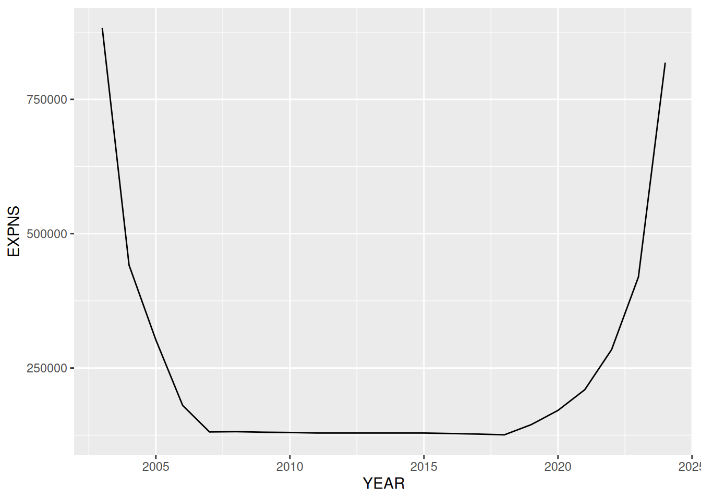
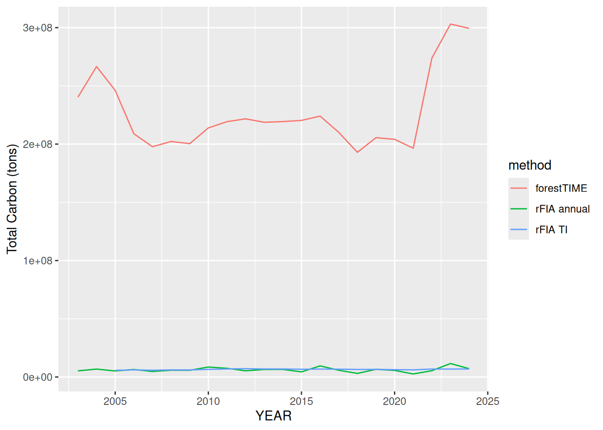

# Population scaling

``` r
library(forestTIME)
#> ! forestTIME is an experimental package and currently a work-in-progress. It is
#>   not an official product of the US Forest Service.
library(dplyr)
#> 
#> Attaching package: 'dplyr'
#> 
#> The following objects are masked from 'package:stats':
#> 
#>     filter, lag
#> 
#> The following objects are masked from 'package:base':
#> 
#>     intersect, setdiff, setequal, union
library(rFIA)
library(ggplot2)
```

How can we use the interpolated data produced by `forestTIME` to get
popluation-level (i.e. state-level) per-area estimates?

> **Warning**
>
> The interpolated values produced by `forestTIME` are *inferences* and
> not samples, so it may not be appropriate to use (modified)
> design-based estimators, as we do in this vignette, which treat the
> data, including interpolated values, as a probablity sample.

## Example data

We’ll use RI as an example state because it is small. We’ll just use the
built-in example data that comes with `forestTIME`, but if you were to
download your own and you wanted to use it with `rFIA` also, make sure
to set `extract = "rFIA"` to extract all the tables needed for both
`forestTIME` and `rFIA`.

``` r
fia_download(states = "RI", download_dir = "fia", extract = "rFIA")
```

> **Important**
>
> `rFIA` produces estimates of carbon from 33 – 40.7 tons/acre using
> design-based estimators. “Correct” estimates should be in this
> ballpark.
>
> ``` r
> rfia_RI <- readFIA(
>   dir = system.file("exdata", package = "forestTIME"),
>   states = "RI"
> )
>
> agc_rfia_annual <-
>   biomass(
>     rfia_RI,
>     totals = TRUE,
>     method = "annual",
>     treeType = "live",
>     landType = 'forest',
>     component = "AG",
>     areaDomain = COND_STATUS_CD == 1 & INTENSITY == 1
>   ) |>
>   mutate(method = "rFIA annual") |>
>   select(method, YEAR, carbon_ton_acre = CARB_ACRE, carbon_total = CARB_TOTAL)
> #> Warning: The `.dots` argument of `group_by()` is deprecated as of dplyr 1.0.0.
> #> ℹ The deprecated feature was likely used in the dplyr package.
> #>   Please report the issue at <https://github.com/tidyverse/dplyr/issues>.
>
> agc_rfia_ti <-
>   biomass(
>     rfia_RI,
>     totals = TRUE,
>     method = "TI",
>     treeType = "live",
>     landType = 'forest',
>     component = "AG",
>     areaDomain = COND_STATUS_CD == 1 & INTENSITY == 1
>   ) |>
>   mutate(method = "rFIA TI") |>
>   select(method, YEAR, carbon_ton_acre = CARB_ACRE, carbon_total = CARB_TOTAL)
>
> mean(agc_rfia_annual$carbon_ton_acre)
> #> [1] 34.03135
> mean(agc_rfia_ti$carbon_ton_acre)
> #> [1] 34.01003
> ```

We’ll use the standard basic workflow to get estimated aboveground
carbon for each tree in each year.

``` r
# Data prep
db <- fia_load(
  "RI",
  dir = system.file("exdata", package = "forestTIME")
)
data <- fia_tidy(db) #single tibble
#> ℹ Wrangling data
#> ✔ Wrangling data [667ms]
#> 

# Expand to include all years between surveys and interpolate/extrapolate
# Adjust for mortality and estimate carbon.
data_midpt <- data |>
  fia_annualize(use_mortyr = FALSE) |>
  fia_estimate()
#> ℹ Prepping for estimating carbon
#> ℹ Adjusting for mortality
#> ℹ Interpolating between surveys
#> ℹ Expanding years between surveys
#> ✔ Expanding years between surveys [6.1s]
#> 
#> ℹ Interpolating between surveys
✔ Interpolating between surveys [23.1s]
#> 
#> ℹ Adjusting for mortality
✔ Adjusting for mortality [34.8s]
#> 
#> ℹ Prepping for estimating carbon
✔ Prepping for estimating carbon [35.2s]
#> 
#> ⠙ Estimating carbon: prepping data
#> ⠹ Estimating carbon: finding merchantable height
#> ⠸ Estimating carbon: predicting merchantable stem wood volume
#> ⠼ Estimating carbon: predicting stump wood and bark volume
#> ⠴ Estimating carbon: predicting sawlog stem wood volume
#> ⠦ Estimating carbon: predicting total biomass
#> ⠧ Estimating carbon: predicting foliage weight
#> ✔ Estimating carbon: harmonizing components [29.8s]
```

I’ll add domain indicator columns as is done in the `rFIA` demystified
vignette so we calculate carbon in live trees per area of forested land
using base intensity plots only. Reason:

> We build separate domain indicators for estimating tree totals and
> area totals, because we can specify different domains of interest for
> both. For example, if we used our tree domain (live trees on forest
> land) to estimate area, then we would not actually be estimating the
> full forested area in RI. Instead we would estimate the forested area
> ONLY where live trees are currently present.

So we can’t just `filter(STATUSCD == 1 & COND_STATUSCD == 1)` to
estimate carbon tons/acre.

``` r
data_midpt <-
  data_midpt |>
  mutate(
    aDI = if_else(COND_STATUS_CD == 1 & INTENSITY == 1, 1, 0), #forested land
    tDI = if_else(STATUSCD == 1, 1, 0) * aDI #live trees on forested land
  )
```

## Expansion factors

There are two issues in using the `EXPNS` provided in the FIA data with
our annualized data: 1) it is not straightforward to join the tables in
to get the `EXPNS` column, and 2) there are now many more plots in each
year, so the `EXPNS` column is no longer accurate (it is the acres of
the entire state represented by each plot). Therefore,
[`fia_calc_expns()`](https://evans-ecology-lab.github.io/forestTIME/reference/fia_calc_expns.md)
calculates the `EXPNS` column as the total land area of the state
divided by the number of plots in the interpolated data for that state
in each year.  
We think these `EXPNS` values can be used much in the same way as the
ones in the “raw” FIA database.

``` r
data_midpt <- data_midpt |> fia_calc_expns()

data_midpt |>
  select(YEAR, EXPNS) |>
  group_by(YEAR) |>
  summarize(EXPNS = unique(EXPNS)) |>
  ggplot(aes(x = YEAR, y = EXPNS)) +
  geom_line()
```



You’ll notice that the calculated `EXPNS` follow a “U” shape rather than
being constant. That is because in our interpolated data, there are
fewer plots in the beginning and end of the timeseries because we do not
extrapolate beyond a panel’s first and last inventory.

Using these expansion factors, we can follow the methods in the [FIA
demystified
vignette](https://doserlab.com/files/rfia/articles/fiademystified#without-sampling-errors).

``` r
tree_totals <- data_midpt |>
  group_by(plot_ID, YEAR) |>
  summarize(
    # purposefully omits ajustment factor `aAdj` because it is assumed to be 1
    carbPlot = sum(CARBON_AG * TPA_UNADJ * EXPNS * tDI / 2000, na.rm = TRUE), #tons/plot
  )
#> `summarise()` has grouped output by 'plot_ID'. You can override using the
#> `.groups` argument.

area_totals <- data_midpt |>
  group_by(plot_ID, YEAR) |>
  # Keep only one row for each condition in each plot and year
  distinct(CONDID, COND_STATUS_CD, CONDPROP_UNADJ, EXPNS, aDI) |>
  summarize(
    # purposefully omits ajustment factor `aAdj` because it is assumed to be 1
    forArea = sum(CONDPROP_UNADJ * EXPNS * aDI, na.rm = TRUE) #acres/plot
  )
#> `summarise()` has grouped output by 'plot_ID'. You can override using the
#> `.groups` argument.

agc_pop <- inner_join(tree_totals, area_totals) |>
  group_by(YEAR) |>
  summarize(
    CARB_AG_TOTAL = sum(carbPlot, na.rm = TRUE), # tons/plot
    AREA_TOTAL = sum(forArea, na.rm = TRUE) # acres/plot
  ) |>
  # the units work out to still be tons(live carbon)/acre(forested land) even if the variable names are misleading
  mutate(method = "forestTIME", carbon_ton_acre = CARB_AG_TOTAL / AREA_TOTAL) |>
  select(
    method,
    YEAR,
    carbon_ton_acre,
    carbon_total = CARB_AG_TOTAL,
    AREA_TOTAL
  )
#> Joining with `by = join_by(plot_ID, YEAR)`
agc_pop
```

``` r
all <- bind_rows(agc_rfia_annual, agc_rfia_ti, agc_pop)

ggplot(all, aes(x = YEAR, y = carbon_total, color = method)) +
  geom_line() +
  labs(y = "Total Carbon (tons)")
```



``` r

ggplot(all, aes(x = YEAR, y = carbon_ton_acre, color = method)) +
  geom_line() +
  labs(y = "Mean Carbon/Acre (tons/acre)")
```


We have some ballbark similar estimates to the ones `rFIA` produces.
